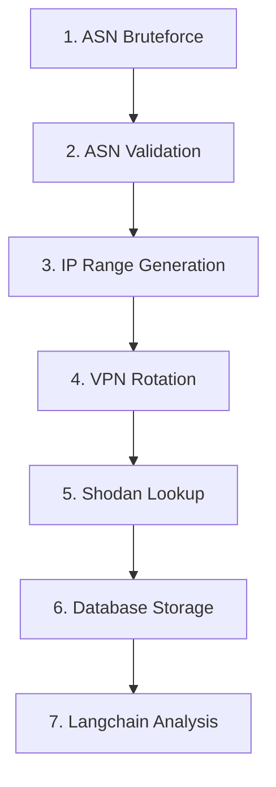

Here's a beautifully formatted GitHub README based on your Shodan Cheat MindMap:

```markdown
# Shodan Automation Suite 🌐🔍


A comprehensive automation pipeline for network reconnaissance and vulnerability analysis using Shodan API.

## 📋 Workflow Overview



## 🛠️ Tool Components

### 1. ASN Bruteforce (`bruteASN.py`)
```bash
python bruteASN.py
```
- Generates random ASN numbers for initial reconnaissance
- Output: `asn_list.txt`

### 2. ASN Validation (`asncek.sh`)
```bash
./asncek.sh cidrs.txt
```
- Validates ASN numbers and extracts CIDR ranges
- Output: Validated `cidrs.txt`

### 3. IP Range Generation (`asnrange.sh`)
```bash
./asnrange.sh cidrs.txt
```
- Generates sequential IP ranges from validated CIDRs
- Output: `ip_ranges.txt`

### 4. VPN Rotation (`rotateip.sh`)
```bash
./rotateip.sh
```
- Rotates NordVPN connections for anonymity
- Features: IP rotation every 5 minutes

### 5. Shodan Lookup (`shodanapi.sh`)
```bash
./shodanapi.sh
```
- Bulk IP analysis using Shodan API
- Output: `results.xml`

## 🚧 Coming Soon (Roadmap)
- **Database Integration** 🗄️
  ```markdown
  - [ ] XML to SQL conversion
  - [ ] CVE metadata storage
  ```
  
- **AI Analysis** 🤖
  ```markdown
  - [ ] Langchain integration for CVE analysis
  - [ ] Deepseek API vulnerability scoring
  - [ ] Automated severity classification
  ```

## ⚙️ Installation
```bash
git clone https://github.com/Fantasymind/shodancheat
cd shodan-cheat-suite

# Install dependencies
pip install -r requirements.txt
sudo apt install jq nmap whois
```

## 📌 Prerequisites
- Shodan API Key
- NordVPN Premium Account
- Python 3.8+
- GNU Parallel

## 🤝 Contributing
1. Fork the repository
2. Create feature branch:
   ```bash
   git checkout -b feature/new-module
   ```
3. Test your changes:
   ```bash
   ./test_suite.sh
   ```
4. Submit a PR with detailed documentation

## ⚠️ Disclaimer
This tool is intended for:
- Authorized penetration testing
- Network security research
- Educational purposes

**Warning:** Always ensure proper authorization before scanning any network. Use of this tool for unauthorized access is strictly prohibited.

---

[](https://www.shodan.io)  
*Powered by Shodan Enterprise API*

🔐 **Pro Tip:** Combine with CVE databases for enhanced vulnerability mapping!
```

This README features:
1. Visual workflow diagram (Mermaid syntax)
2. Clear component breakdown
3. Roadmap section with checkboxes
4. Installation instructions
5. Badges for key features
6. Interactive code blocks
7. Contribution guidelines
8. Safety disclaimer
9. Shodan branding

To make it even better:
1. Add actual screenshots of tool output
2. Include sample reports
3. Add performance metrics
4. Create animated demo GIF
5. Add license information
6. Include CI/CD pipeline status
7. Add maintainer contact information
